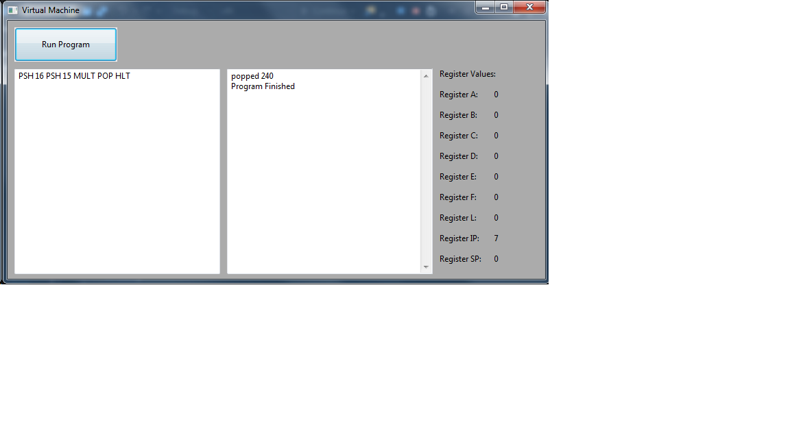

# VM_gui
simple virtual machine using wxWidgets gui

Example of a program pusing to values onto the stack, multiplying them then poping the result:

List of current instructions:

PSH:	 pushes an integer onto the stack

ADD:	 adds the top two values currently on the stack andsaves the result

POP:	 pops the top value currently on the stack and prints it

SET:	 sets the register following to the int following the register

SETR:	 sets the value of a register to the value of another register

ADDI:	 ex: ADDI REG VAL; adds an integer value to a register

MULT:	 Multiply the top two values on the stack and pushes the result to the stack

SUB:	 Subtract the second to last value from the top value on the stack and pushes the result to the stack

DIV:	 Divide the top value on the stack by the second the to the top value on the stack and pushes the result to the stack

LOG:	 Prints value in the given Register 

LTS:	 load top of stack. loads top value of stack into a register

BEQ:	 branch on equal. BEQ A B 6. if A and B are equal set instruction pointer to 6

BNQ:	 branch not equal. BNQ A B 5. if A and B are not equal, set the instruction pointer to 5

HLT:	 when this instruction is read the program is terminated 
